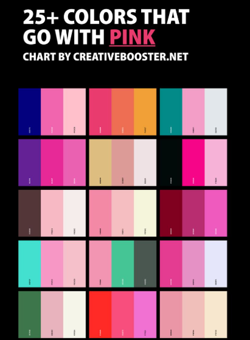
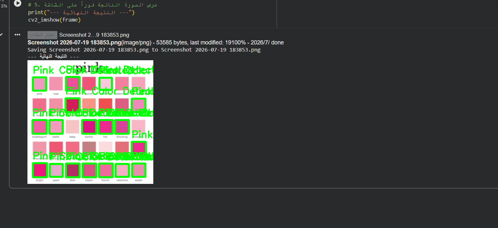

# Color Recognition Project

A computer vision project using OpenCV to analyze color combinations and detect if a specific "combo" contains the color Pink by utilizing HSV color space filtering.

---

## 🎯 Project Concept

The core concept of this project is to analyze various multi-color palettes and combinations. The algorithm processes the image to answer a specific question: **Does this color combo contain Pink?** 

If a match is found, the system isolates the color, highlights its exact boundaries, and tags it instantly while ignoring all other non-pink colors in the combination.

---

## 📸 Project Showcase

### 1. Original Color Combo (`pink.png`)
<p align="center">
  
</p>

### 2. Detection Result (`pink_result.png`)
<p align="center">
  
</p>

---

## 💻 OpenCV Code

```python
import cv2
import numpy as np
from google.colab import files
from google.colab.patches import cv2_imshow

uploaded = files.upload()
file_name = list(uploaded.keys())[0]

frame = cv2.imread(file_name)

hsv_frame = cv2.cvtColor(frame, cv2.COLOR_BGR2HSV)
lower_pink = np.array([140, 50, 50])
upper_pink = np.array([170, 255, 255])
pink_mask = cv2.inRange(hsv_frame, lower_pink, upper_pink)

contours, _ = cv2.findContours(pink_mask, cv2.RETR_TREE, cv2.CHAIN_APPROX_SIMPLE)

for contour in contours:
    area = cv2.contourArea(contour)
    if area > 100:
        x, y, w, h = cv2.boundingRect(contour)
        cv2.rectangle(frame, (x, y), (x + w, y + h), (0, 255, 0), 1)
        cv2.putText(frame, "Pink Detected", (x, y - 4), 
                    cv2.FONT_HERSHEY_SIMPLEX, 0.3, (0, 255, 0), 1)

print("--- Final Result ---")
cv2_imshow(frame)
